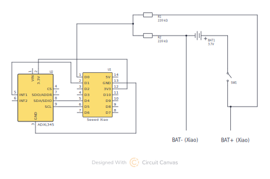

# 🎲 PowerDice   
## 🧾 Description

An IoT device based on the XIAO ESP32C3 and ADXL345 accelerometer
publishing dice roll events via MQTT to Home Assistant.

For more information, see:
https://www.printables.com/model/1587364-powerdice-smart-iot-dice

Vibe-coded — use at your own risk.

## 🏗️ Environments

The project supports two deployment environments with different levels of system integration:

### 🐳 Docker (deprecated setup)

MQTT uses an external broker (NanoMQ). The broker and HA are deployed as separate containers.

👉 [View Docker setup](./docker/INFO.md)

### 🍓 Raspberry Pi (current setup)

Runs entirely on Home Assistant OS using the built-in Mosquitto MQTT broker add-on.

👉 [View Raspberry Pi setup](./raspberry/INFO.md)

## 🔌 Hardware

<small>View full-size diagram: https://circuitcanvas.com/p/bfxgqpgykhrte89nrw1</small>

### ⚡ Wiring

| XIAO Pin | Connection | Target | Description |
|----------|------------|--------|-------------|
| **3V3** | → | ADXL345 (VIN) | Power supply |
| **GND** | → | ADXL345 (GND) | Ground |
| **D0** (GPIO2) | → (via a voltage divider) | BAT+/BAT- | Battery voltage monitoring |
| **D1** (GPIO3) | → | ADXL345 (INT1) | Activity interrupt (wake-up) |
| **D4** (GPIO6) | → | ADXL345 (SDA) | I2C data line |
| **D5** (GPIO7) | → | ADXL345 (SCL) | I2C clock line |

### ⚠️ Important notes

In my setup, the wiring schematic differs slightly (see Printables images), as I used 4× 100kΩ resistors instead of the values recommended by [Seeed Studio](https://wiki.seeedstudio.com/XIAO_ESP32C3_Getting_Started/#check-the-battery-voltage).

For best compatibility and accuracy, follow their design:

- Voltage divider: use **2× 220kΩ resistors**

## 🛡️ Security considerations

This project is a baseline implementation and does **not include TLS/SSL, certificates, or hardened MQTT configuration**.

You are responsible for:

- securing MQTT (authentication, ACLs) — [see how](https://github.com/home-assistant/addons/blob/master/mosquitto/DOCS.md)
- securing Home Assistant access — [see how](https://www.home-assistant.io/docs/configuration/securing/)
- network isolation where required
- adapting security to your threat model
  
## 👍 Support

If this project helped you, consider leaving a star on GitHub ⭐